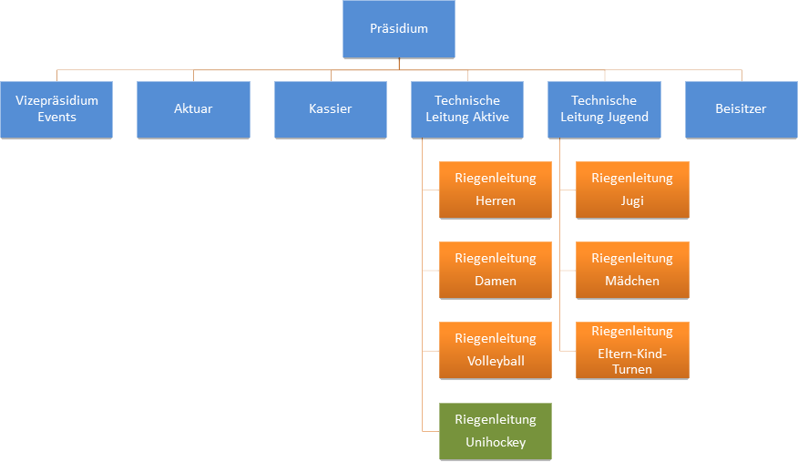

Der Verein wird durch den Vorstand geführt.
Dieser trifft sich regelmässig, um die Geschicke des Vereins zu lenken.
Dazu gehört neben der Organisation öffentlicher und interner Anlässe auch die Planung der Trainingssaison.
Neben den üblichen Ämtern gehören dem Vorstand zudem die technischen Leiter der Aktiv- und der Jugendabteilung an.
Diese vertreten die einzelnen Riegen im Vorstand und sorgen für die nötige Kommunikation untereinander.

Die jeweiligen [Riegen](/riegen/) verfügen jeweils über einen Riegenleiter,
welcher die Trainings organisiert und mithilfe seiner (Hilfs-)Leiter durchführt.
Ausnahme bildet hier der [Unihockey-Spielbetrieb Wildgoose Wil-Gansingen](https://wildgoose.ch/),
welcher eine Spielgemeinschaft mit dem [TSV Gansingen](https://www.tsvgansingen.ch/) darstellt.

Organigramm
-----------

Eine Übersicht der kompletten Vereinsorganisation zeigt das folgende Organigramm.

Statuten
--------

Weitere informationen finden sich in den Vereinsstatuten:

❗ [statuten_tsv_mettauertal.pdf](/about/downloads/statuten_tsv_mettauertal.pdf)
