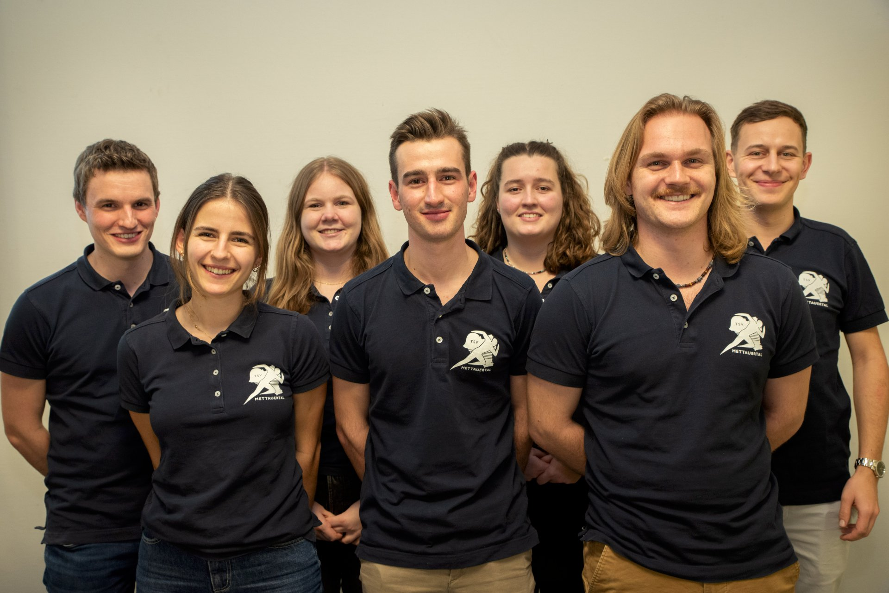

Die [Organisationsstruktur](/about/organisation) des Vereins verlangt
von jedem einzelnen Vorstandsmitglied klare und präzise Kommunikation.
Die Führung des Vereins obliegt dem Präsidium.
Unter Assistenz des Aktuariates leitet es die administrativen Geschicke
und ist um den reibungslosen Ablauf der Generalversammlung besorgt.
Nebst dem Ressort Finanzen, welches sich um die Buchführung der Vereinskasse kümmert,
ist eine zusätzliche Person mit der Einsatzkoordination aller kommerziellen öffentlichen Anlässe vertraut.
Die beiden technischen Leiter sind durch ihre Zuständigkeit als Sprachrohr
für die Jugend- und Aktivenabteilung besonders gefordert.

Von links nach rechts:

| Person         | Amt                           |
|----------------|-------------------------------|
| Reto Oeschger  | Event- und Materialmanagement |
| Sabrina Müller | Finanzen                      |
| Dominik Weber  | Vizepräsidium                 |
| Larissa Weiss  | Aktuariat                     |
| Michel Senn    | Präsidium                     |
| Rahel Hüsler   | Technische Leitung Aktive     |
| Kim Roth       | Technische Leitung Jugend     |
